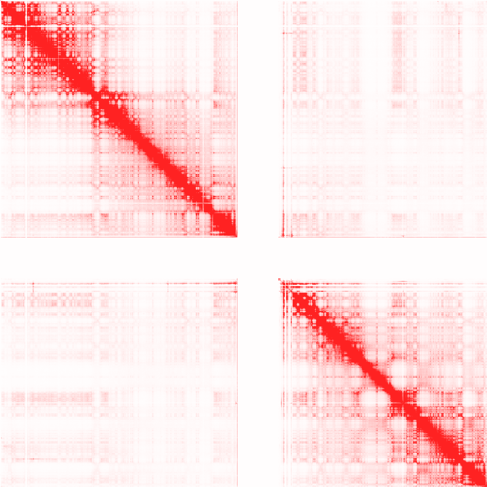

Big Contact Map (BCM) tools
===========================

[](https://travis-ci.org/kaizhang/BCMtools)

Installation
------------

### Install GHC Haskell Compiler

#### For general user

You can get a copy of GHC by downloading and installing the latest [Haskell-platform](https://www.haskell.org/platform/).

#### For CentOS 6.5

For CentOS users, there is no binary distribution of Haskell platform available. Please follow these steps to install GHC and cabal:

1. Download [GHC](https://www.haskell.org/ghc/dist/7.8.4/ghc-7.8.4-x86_64-unknown-linux-centos65.tar.bz2) binary distribution.

2. Extract files: `tar xf ghc-7.8.4-x86_64-unknown-linux-centos65.tar.bz2`.

3. Read "INSTALL" file and follow the instruction to install GHC.

4. Download [cabal-install-1.20](https://hackage.haskell.org/package/cabal-install-1.20.0.6/cabal-install-1.20.0.6.tar.gz).

5. `tar zxf cabal-install-1.20.0.6.tar.gz && cd cabal-install-1.20.0.6 && ./bootstrap.sh`.

6. add `$HOME/.cabal/bin` to your system searching path.


### Install BCMtools

Open a terminal, type `cabal update && cabal install alex && cabal install BCMtools`.

After these steps, you will have the `bcmtools` executable in you cabal library directory. In Linux, this is typically under `$HOME/.cabal/bin/`. You can type `bcmtools --help` to get help information, and type `bcmtools COMMAND --help` to get more specific information.

Input format
------------

BCMtools accept two types of input.

1. 3-column tsv. Example:

```
5000  \t 10000 \t  3.0
10000 \t 20000 \t  4.0
 .     .   .   .    .
 .     .   .   .    .
 .     .   .   .    .
```

This format is convenient for processing intra or inter chromosome contact maps. Every entries in the same column would then belong to the same chromsome.

2. 5-column tsv. Example:

```
chr1 \t 5000 \t chr2 \t 20000 \t 4.0
chr1 \t 5000 \t chr1 \t 30000 \t 2.0
```

File conversion
---------------

To use BCMtools, we will need to convert text file to bcm files. bcm files are binary files which are designed to store huge matrix. This step will take 3-column/5-column tsv as input. Example:

``bcmtools convert -g hg19 -s 100K -r chr1 -c chr1 -i input --symmetric -o 100K.bcm``

Options:

* `--symmetric`: this tells BCMtools to store only half of the matrix.
* `--sparse`: if this flag is turn on, BCMtools will store the matrix as a Compressed Sparse Row (CSR) matrix. This will save huge amout of space when the matrix is very sparse. (Note: Sparse storage requires sorted input. We don't provide tools for sorting, yet. You can use unix sort to sort the input)

Visualization
-------------

``bcmtools view 100K.bcm --range 0-150 -o ouput.png``



By default, BCMtools stores whole matrix in memory. If the `--disk` flag is turned on, BCMtools will perform all computation on disk, and only a tiny amount of data is stored in memory. This could be very useful when the matrix is large and memory is scarce.
